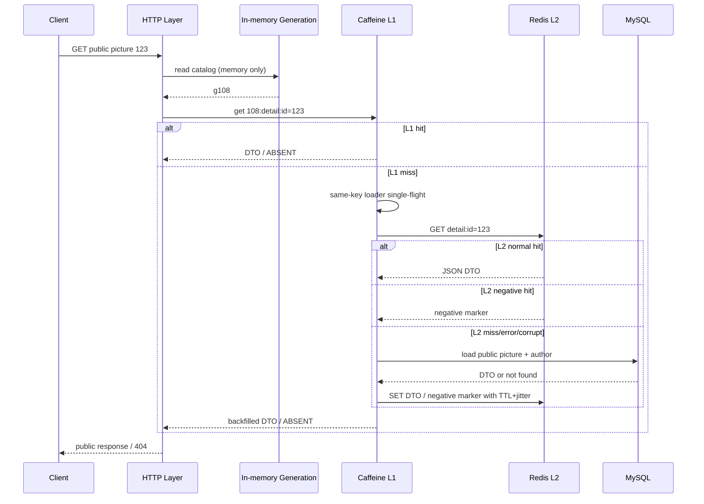

# 茶杯图库多级缓存链路设计

> 状态：现行方案整合文档<br>
> 整合日期：2026-09-27<br>
> 适用范围：`backend/` 的公开图库列表、公开图片详情及公开图片资源链路<br>
> 一致性等级：有界最终一致，不是强一致

## 1. 文档定位

本文只整合以下三份材料：

- `docs/缓存方案简化设计.html`
- `docs/缓存三大问题_面试说辞.html`
- `docs/cache-architecture-redesign.md`

三份材料处于不同阶段：

| 材料 | 定位 | 在本文中的用途 |
| --- | --- | --- |
| `缓存方案简化设计.html` | 2026-09-25 已落地的简化方案 | 现行架构、读写链路、失效协议和参数的主要事实来源 |
| `缓存三大问题_面试说辞.html` | 基于现行方案整理的工程判断 | 补充穿透、击穿、雪崩的边界、数字和加回条件 |
| `cache-architecture-redesign.md` | 已被简化版取代的重方案 | 保留缓存边界、安全原则、故障分类，以及为什么放弃重方案的决策背景 |

本文不把已经下线的 Cache Gateway、事务 Outbox、RabbitMQ 缓存失效事件、Redisson 分布式锁、软硬双 TTL 和后台刷新描述成当前能力。它们只出现在“架构演进与取舍”章节中。

## 2. 结论先行

当前方案是一个面向公开读模型的多级 Cache-Aside：

```text
浏览器 / 代理 HTTP 缓存（仅公开响应和公开资源）
        ↓ miss / revalidate
L1：进程内 Caffeine（每个后端实例独立）
        ↓ miss
L2：Redis 共享缓存（多个后端实例共享）
        ↓ miss / 读取异常 / 缓存损坏
L3：MySQL / MinIO（唯一事实来源）
```

跨实例失效没有使用消息推送，而是使用一个 Redis 目录版本号：

```text
业务事务提交
  → 精确删除该图片的 Redis 详情键
  → 目录版本号原子加一
  → 当前实例立即更新内存版本号
  → 其他实例最多在下一次轮询时切换版本号
  → 旧 L1 键和旧列表 L2 键失去访问者，等待 TTL / 容量策略回收
```

这个设计的核心不是“缓存越多越好”，而是四个判断：

1. MySQL 和 MinIO 是事实来源，缓存只保存可重建的公开派生结果。
2. 详情键有界，可以精确删除；列表键由游标和页大小组合而成，无法枚举，使用版本号整体换代。
3. L1 的 TTL 本身提供最终收敛上界，失效通知用于加速收敛，不承担永久正确性的唯一责任。
4. 回源只是毫秒级主键查询，因此只做实例内 single-flight，接受最多三个实例分别回源，不使用跨实例分布式锁。

## 3. 缓存边界

### 3.1 当前进入多级缓存的数据

| 数据 | L1 Caffeine | L2 Redis | HTTP 缓存 | 一致性 |
| --- | --- | --- | --- | --- |
| 公开图片详情 DTO | 是 | 是 | 可用 ETag / Cache-Control | 有界最终一致 |
| 公开图库游标页 | 是 | 是 | 可用 ETag / Cache-Control | 有界最终一致 |
| 公开图片二进制 | 否 | 否 | 可缓存公开资源响应 | 由 MinIO 保存，后端资源接口读取 |

当前核心读点只有公开列表和公开详情。公开 DTO 不包含私有空间信息、审核备注、分享密钥或权限状态。

### 3.2 默认不进入这套共享缓存的数据

| 数据 | 原因 | 处理方式 |
| --- | --- | --- |
| 私有图片详情、个人空间列表 | 依赖用户、成员、角色和权限版本，缓存键与失效维度复杂 | 先鉴权，再读事实来源；不能因缓存命中跳过权限检查 |
| 管理员审核队列 | 写入频繁、权限敏感、实时性要求高 | 使用数据库查询、索引和分页约束 |
| 分享口令、撤销和过期状态 | 属于安全状态，不允许用可能陈旧的普通缓存放行 | 使用其权威状态与失败关闭策略 |
| Session、AI 配额、限流、分布式租约 | 即使位于 Redis，也属于业务状态而不是可丢失缓存 | 使用独立 keyspace、容量和持久化策略 |
| MinIO 原图、缩略图二进制 | 对象大、生命周期独立，不适合进入 JVM 或 Redis | 私有 MinIO 持久化，前端只访问后端资源 URL |

### 3.3 安全规则

缓存只能加速公开读模型，不能替代：

- 空间成员和角色检查；
- 分享 secret、密码、撤销时间和过期时间检查；
- 管理员权限检查；
- 私有 MinIO 对象的鉴权下载。

公开与私有的边界必须先确定，再决定是否允许进入缓存。不能为了命中率把带权限语义的 DTO 放入共享缓存。

## 4. 核心组件和职责

现行方案可以按三个核心职责理解，另有统一键定义和本地缓存配置：

| 组件 | 职责 |
| --- | --- |
| `PublicReadCache` | 串联 L1、L2 和数据库 loader；处理负值、序列化、TTL 抖动、异常降级和读指标 |
| `CacheGeneration` | 在内存中保存当前目录版本；启动同步、定时轮询、原子递增，Redis 异常时沿用最后一次成功值 |
| `PublicPictureInvalidation` | 在事务提交后执行“删详情键 + 抬目录版本号” |
| `PublicPictureCacheKeys` | 集中定义缓存名、Redis 前缀、目录版本键、游标规范化和列表 identity |
| 本地缓存配置 | 创建 Caffeine 实例，设置容量、单 TTL 和统计开关 |

与旧重方案相比，当前链路没有：

- Cache Gateway 和复杂 Envelope 状态机；
- 每张图片一个版本号；
- Redis 分布式锁和 Redisson；
- soft TTL、hard TTL 和 stale-while-revalidate；
- 后台刷新线程池和手写在途表；
- 缓存失效 Outbox、RabbitMQ 交换机、队列和消费者；
- `KEYS`、`SCAN` 或通配符删除。

## 5. 关键参数

以下是三份材料中描述的现行初始值。这些是可调参数，不是永久常量：

| 参数 | 初始值 | 作用 |
| --- | ---: | --- |
| 后端实例数 | 3 | 决定未加跨实例锁时，同一键理论上的最大并行回源实例数 |
| L1 最大条目数 | 20,000 | 控制单实例 JVM 内存占用 |
| L1 TTL | 60 秒 | 本地值和本地负值的生命周期，也是失效失败时的重要兜底 |
| L2 详情基础 TTL | 60 秒 | 公开详情 Redis 值的基础生命周期 |
| L2 列表基础 TTL | 30 秒 | 公开列表 Redis 值的基础生命周期 |
| L2 负值基础 TTL | 15 秒 | 不存在或不可公开图片的共享负值生命周期 |
| Redis TTL 抖动 | 0～20% | 打散自然过期时刻，缓解同批 key 同时失效 |
| 版本号轮询间隔 | 500 毫秒 | 正常情况下其他实例感知失效的时间上界 |
| 列表 limit | 1～50 | 限制单次查询开销和缓存 key 基数 |

物理 TTL 的计算形式为：

```text
physicalTtl = baseTtl + random(0, 0.2 × baseTtl)
```

因此大致范围是：

```text
详情：60～72 秒
列表：30～36 秒
负值：15～18 秒
```

随机抖动只解决“自然过期时刻集中”，不是主动失效协议，也不能解决 Redis 整体不可用或热点键击穿。

> 材料校正：面试数字卡中曾出现“列表每页 10～50”，但同一材料正文写的是 1～50，重设计材料也只约束 `limit <= 50`。整合后统一采用 1～50。

## 6. Key 与版本号设计

### 6.1 目录版本号

Redis 中保存一个全局目录版本计数器：

```text
tp:cache:gen:catalog
```

它不是业务数据，也不参与值校验；它只定义当前使用的缓存命名空间。

```text
generation = 108  → 请求只访问 g108 对应的命名空间
generation = 109  → 所有新请求切换到 g109，g108 旧键不再被访问
```

使用单调计数器而不是时间戳的原因：

- 不依赖多个实例的系统时钟一致；
- 同一时间单位内的多次变更不会发生冲突；
- Redis 原子递增天然全局有序；
- 重复递增只会跳过几个数字，不会让版本回退。

### 6.2 L1 Key

L1 的详情和列表 key 一律包含当前目录版本号：

```text
{catalog}:{cacheName}:{identity}
```

概念示例：

```text
108:public-picture-detail:id=123
108:public-picture-list:cursor=first:limit=20
```

这样做的原因是 Caffeine 属于各实例私有内存：实例 A 无法直接删除实例 B 的本地条目。版本号变化后，各实例不需要枚举或清空本地缓存，只要开始拼新 key，旧条目就自动失去访问者。

代价是：任意一张公开图片变化，所有实例的本地详情和列表缓存都会整体换代。写入频繁时，L1 命中率可能下降。

### 6.3 L2 详情 Key

详情共享 key 不包含版本号：

```text
tp:cache:{detail-cache-name}:id={pictureId}
```

原因：详情 key 与图片一一对应，数量有界。图片 123 变化时可以直接删除图片 123 的 key，不需要维护与图片数量等量的版本计数器，也不需要在每次详情读取时额外访问 Redis 获取每图版本。

### 6.4 L2 列表 Key

列表共享 key 包含目录版本号：

```text
tp:cache:{list-cache-name}:g{catalog}:cursor={canonicalCursor}:limit={limit}
```

列表 key 由游标和页大小组合，集合没有可安全枚举的上界。公开图片发生变化后，不能依靠 `SCAN` 找出所有相关页，因此通过目录版本号整体切换命名空间。

### 6.5 游标规范化

用户传入的 cursor 不应原样拼进 Redis key。应先进行规范化或 URL-safe 编码：

```text
null / blank cursor → first
非空 cursor         → canonical / Base64 URL-safe identity
```

这样可以避免特殊字符污染 key，并让语义相同的输入稳定映射到同一个 key。

## 7. 公开详情完整读链路

下面以读取公开图片 `123` 为例。



逐步说明：

1. 接口先校验图片 ID；非正整数不进入缓存链路。
2. 从当前实例内存读取目录版本号。这个动作没有 Redis 往返。
3. 使用“目录版本 + 缓存名 + 图片 ID”查询 Caffeine。
4. L1 命中正常对象时直接返回；命中本地负值哨兵时直接返回不存在。
5. L1 未命中时，通过 Caffeine 的带 loader 读取进入加载流程。
6. 同一 JVM 内同一个 key 同时只会执行一个 loader，其他线程等待并复用结果。
7. loader 查询 Redis 详情 key。
8. Redis 命中正常 JSON 时，反序列化为公开 DTO，自动回填 L1。
9. Redis 命中负值标记时，L1 回填本地负值哨兵。
10. Redis 未命中、读取异常或 payload 无法反序列化时，统一按 miss 处理，回源 MySQL。
11. 数据库 loader 只返回“可公开”的 DTO；不存在或不可公开统一转换为 `null` 语义交给缓存层。
12. 正常 DTO 写入 Redis 详情 key；不存在结果写入短 TTL 负值标记。
13. Redis 写入失败不影响本次数据库结果返回，L1 仍会保存本次加载结果。
14. Controller 在应用缓存之外处理公开 HTTP 响应、ETag 和 Cache-Control。

### 7.1 为什么需要两种负值

Caffeine 不接受 `null` 缓存值，因此 L1 使用进程内哨兵对象表示“不存在”；Redis 使用固定字符串标记表示“不存在”。

```text
L1：ABSENT object
L2：negative marker
```

固定标记必须与正常 JSON 格式明确区分。空列表是合法业务值，应正常序列化，不能被误判为不存在。

## 8. 公开列表完整读链路

列表链路与详情基本相同，差别集中在 identity 和 L2 key：

```text
请求 cursor + limit
  → 校验 limit，规范化 cursor
  → 读取内存 catalog
  → 查询 L1：{catalog}:list:{cursor}:{limit}
  → miss 时查询 L2：list:g{catalog}:{cursor}:{limit}
  → miss / error / corrupt 时查询 MySQL
  → 写 L2（30 秒基础 TTL + jitter）
  → 回填 L1
  → 返回游标页
```

空列表是合法列表结果，会作为正常对象进入两层缓存，不属于负值。

目录版本号一旦从 `108` 增加到 `109`：

```text
旧请求路径：L1 g108 / L2 list:g108
新请求路径：L1 g109 / L2 list:g109
```

旧列表 key 不需要主动删除，也不允许通过通配符扫描删除。它们会在 Redis TTL 到期后自然消失。

## 9. HTTP 层与图片资源链路

应用缓存和 HTTP 缓存解决的是不同问题：

- L1/L2 减少后端内部的 Redis 与数据库访问；
- ETag 和 Cache-Control 减少客户端重复下载和响应体传输；
- MinIO 保存原图和缩略图二进制，不把二进制塞入 Caffeine 或 Redis。

公开元数据响应可以使用内容 hash 或 generation 生成 ETag，并允许浏览器或代理重验证。私有接口、权限相关响应和预览接口应保持 `no-store`。

公开图片资源应使用稳定且能体现版本的后端 URL。资源内容更新时生成新版本 URL，私有 MinIO 对象仍由后端资源接口读取，不能让浏览器绕过后端直接访问对象存储。

## 10. 写路径与缓存失效

### 10.1 事务顺序

规范顺序是：

```text
开启业务事务
  → 更新图片、发布申请或版本等业务表
  → 提交事务
  → 删除该图片的 Redis 详情 key
  → 目录版本号原子加一
```

`PublicPictureInvalidation` 将“提交后执行”封装在失效入口内部：

- 当前存在活跃事务：注册 `afterCommit` 回调；
- 当前没有事务：立即执行失效；
- 事务回滚：回调不执行，不做无意义失效。

不能在事务提交前删除缓存。否则会出现：

```text
A 更新数据库但尚未提交
A 删除缓存
B 发现缓存 miss，回源数据库
B 仍读到旧值并回填缓存
A 提交
结果：旧值留在缓存中
```

### 10.2 两个失效动作为什么缺一不可

| 动作 | 负责范围 | 不执行的后果 |
| --- | --- | --- |
| 删除详情 L2 key | 该图片的共享详情值，包括共享负值 | 目录版本变化后，新 L1 key 仍可能从旧 L2 详情 key 回填旧值 |
| 目录版本号加一 | 所有实例的 L1，以及所有 L2 列表页 | 其他实例继续命中旧本地值，列表继续访问旧命名空间 |

因此版本号增加不能代替详情删除，详情删除也不能代替版本号增加。

正确执行顺序是先删详情 key，再抬目录版本号。这样可以避免已经切换到新本地命名空间、但共享详情旧值尚未删除的额外窗口。

> 材料校正：简化方案 SVG 的视觉顺序曾画成“版本号加一 → 删除详情键”，但正文、代码骨架和实施语义都要求“先删详情键 → 再加版本号”。本文采用后者作为规范。

### 10.3 跨实例版本同步

每个实例独立维护一个 `volatile` 目录版本：

```text
应用启动      → 主动从 Redis 同步一次
固定间隔      → 每 500ms 从 Redis 读取一次
本实例写成功  → Redis INCR 后立即更新本实例内存值
Redis 读失败  → 沿用上一次成功值
```

读取失败时绝不能退回 `0`。旧的 `g0` 命名空间中可能仍残留历史 key，回退会让请求重新访问极旧数据。

正常情况下，写入实例立即切换版本，其他实例最多约 500 毫秒后切换。因此正常跨实例失效窗口约为缓存命令耗时加一个轮询间隔。

## 11. 一致性模型与已知竞态

### 11.1 立场

这套缓存明确提供有界最终一致：

- 公开图库允许短暂陈旧；
- 私有权限、分享撤销、Session 和安全状态不依赖缓存放行；
- 缓存失效失败不能造成永久错误，最终依赖 TTL 回收；
- 当前方案不保存 stale 状态，Redis 异常时不会从 L2 返回陈旧值。

### 11.2 正常收敛

```text
写事务提交
  → 通常毫秒级完成两条 Redis 命令
  → 当前实例立即切换
  → 其他实例不超过 500ms 感知
```

### 11.3 失效命令失败

| 失败 | 影响 | 兜底 |
| --- | --- | --- |
| 详情删除失败 | 共享详情可能继续返回旧值 | 详情 L2 TTL 到期后收敛 |
| 版本号增加失败 | 旧 L1 与旧列表命名空间继续被使用 | L1 与列表 L2 TTL 到期后收敛 |
| 两条命令均失败 | 本地与共享值都可能短暂陈旧 | 各层 TTL 最终回收 |

简化方案接受删除命令没有后台重试。若业务不能接受这一窗口，应降低详情 TTL 或增加有限重试，而不是默认恢复完整 Outbox 链路。

需要区分“单层 TTL”和“端到端陈旧上界”。三份材料常用“60 秒”描述详情删除失败后的窗口，但按同一批材料给出的参数继续推导：详情 L2 实际可能存活 60～72 秒；如果它在临近过期时被某个 L1 miss 命中，又会重新进入该实例最多 60 秒。因此极端时，旧详情从写事务提交起可能接近 `72 + 60 = 132` 秒后才彻底不可见。这个数字是链路推导值，不是材料中已经压测确认的 SLO。

列表通常不会出现同样长度的叠加：列表 L2 只有 30～36 秒，而既有 L1 可存活 60 秒，L1 到期时旧列表 L2 通常已经过期。负值也可能因临近 L2 到期时回填 L1，将可见窗口延长到大约 `18 + 60 = 78` 秒。若产品对撤回或重新公开的可见性窗口有严格要求，应以端到端链路上界制定契约，而不是只看某一层的 TTL。

### 11.4 删除后被旧读回填

精确删除详情 key 仍无法完全消除下面的竞态：

```text
B 发现 L2 miss
B 回源数据库并读到旧值，此时 A 尚未提交
A 提交事务
A 删除详情 key
B 将刚读到的旧值写回详情 key
结果：旧值继续存在到 TTL 结束
```

旧重方案使用“每图版本号”避免这个问题：B 只会写入旧图片版本对应的 key，而新请求已经切换到新版本 key。

简化方案主动接受这个退步，因为：

- 竞态窗口只是一次数据库读取到 Redis 写回的几毫秒；
- 公开状态变化频率较低；
- 后果是旧值多存活一个短 TTL，而不是永久错误；
- 避免了 O(图片数量) 的版本状态和每次详情读取的额外 Redis 往返。

当图片变化频率达到每秒数十次、出现批量导入或自动审核，或者业务无法接受详情 TTL 级别的最坏窗口时，应重新评估详情版本化。

## 12. 缓存穿透

### 12.1 当前防线

第一道是入口约束：

- 图片 ID 必须是正整数；
- 列表 `limit` 限制为 1～50；
- cursor 先规范化再进入 key。

第二道是两层负值缓存：

```text
数据库判定不存在或不可公开
  → L2 写短 TTL negative marker
  → L1 写 ABSENT 哨兵
  → 后续相同 ID 不再重复落库
```

效果：

- 相同不存在 ID 在 L1 TTL 内不产生网络调用；
- 即使请求落到其他实例，L2 负值仍能阻断数据库；
- 审核通过或重新公开时，“删详情 + 抬版本号”同时清理两层负值的访问路径。

### 12.2 边界

负值缓存只能拦截“同一个不存在编号反复请求”，拦不住“每次换一个新编号”的随机扫描，因为每个新编号第一次仍会回源。

当前没有 Bloom Filter，原因是：

- 当前图片量级和随机扫描成本尚未证明有必要；
- Bloom Filter 存在误判，需要处理重建和删除语义；
- 负值缓存、输入校验和入口限流更简单；
- 已删除但曾存在的 ID 仍需要业务状态判断，Bloom Filter 不能替代数据库语义。

加回条件：监控显示随机 ID 占 DB 回源的主要比例时，先增加按来源维度的入口限流和异常审计，再评估可重建 Bloom Filter。

## 13. 缓存击穿

### 13.1 实例内 single-flight

Caffeine 的 `get(key, loader)` 同时完成：

- 查询本地缓存；
- 对同一 JVM、同一 key 合并并发加载；
- 将 loader 结果写回本地缓存。

因此同一实例中，热点 key 过期瞬间只有一个线程继续访问 Redis 或数据库，其他线程等待同一个结果。无需手写在途表、异步任务句柄和超时清理。

### 13.2 跨实例主动不加锁

当前部署目标是三个后端实例。最坏情况下，一个热点 key 在三个实例上同时 miss，会产生最多三次回源。

当前回源主要是图片和作者的主键等值查询，材料估算为毫秒级。为了避免这几次主键查询而引入 Redisson、租约、等待、超时和错误降级，成本高于收益。

因此当前策略是：

```text
实例内：single-flight，只允许一个 loader
实例间：不协调，最多每实例一个 loader
```

### 13.3 何时加回跨实例协调

出现以下任一条件时重新评估：

- 单次回源耗时超过约 50 毫秒；
- 回源变成未命中索引的聚合或多表连接；
- 回源依赖外部接口；
- 回源包含昂贵计算；
- 三倍瞬时回源已经影响数据库连接池或尾延迟。

届时可以先使用 Redis 的“仅当 key 不存在时创建并带租约”实现轻量 owner 选举，不必立即恢复完整锁框架。

## 14. 缓存雪崩

雪崩需要拆成两个问题。

### 14.1 大量 key 同时自然过期

使用 0～20% TTL 抖动打散到期时刻：

```text
同批详情不都在第 60 秒过期，而是分布在 60～72 秒
同批列表分布在 30～36 秒
同批负值分布在 15～18 秒
```

这只能打散自然过期，不能解决 Redis 整体宕机。

### 14.2 Redis 整体不可用

L1 和 L2 相互独立，目录版本号也保存在实例内存：

- L1 已命中的热点数据继续服务，不访问 Redis；
- 版本同步失败时沿用最后一次版本，不阻塞读请求；
- L1 miss 的请求将 Redis 读失败视为 miss，直接访问数据库；
- Redis 写失败不影响本次数据库结果返回。

这避免了 Redis 故障时所有请求先等待连接超时，但仍存在一个明确缺口：长时间 Redis 不可用叠加大量冷数据请求，会把数据库连接池变成下一个瓶颈。

当前材料记录的补强条件是：数据库连接池较小或观察到 Redis 故障期间回源并发不可控时，为 loader 增加信号量 / bulkhead 限流；公开入口出现扫描时增加来源维度限流。

## 15. 故障降级矩阵

下表采用现行简化方案语义。旧重方案中的 hard TTL stale 返回、分布式锁和 RabbitMQ 降级不再属于当前能力。

| 故障 | L1 已命中 | L1 未命中 | 一致性结果 |
| --- | --- | --- | --- |
| Redis 读取失败 | 继续返回 L1 值 | 直接回源 MySQL | Redis 恢复前冷数据增加 DB 压力 |
| Redis 写入失败 | 不影响 | 返回 loader 结果并写 L1 | L2 命中率下降，不影响本次结果 |
| 版本同步读取失败 | 使用当前内存版本 | 使用当前内存版本 | 可能延迟感知其他实例的失效，不回退旧命名空间 |
| 详情删除失败 | 可能继续命中旧值 | 可能从旧 L2 回填 | 等详情 TTL 收敛 |
| 版本号增加失败 | 继续访问旧 L1 / 列表命名空间 | 旧命名空间可能继续回填 | 等 L1 和列表 TTL 收敛 |
| Redis payload 损坏 | 已有 L1 不受影响 | 反序列化失败按 miss 回源 | 新值覆盖旧 payload，不形成 500 风暴 |
| MySQL 不可用 | 可在 L1 生命周期内继续命中 | loader 失败，请求失败 | 当前方案没有 stale/hard TTL 兜底 |
| MinIO 不可用 | 元数据缓存可能仍命中 | 二进制资源读取失败 | 缓存不能伪造图片内容可用性 |

## 16. 架构演进：为什么放弃重方案

已下线的重方案曾包含：

- 统一 Cache Gateway 和 JSON Envelope；
- 本机 single-flight + Redis 分布式锁；
- soft/hard TTL 和 stale-while-revalidate；
- 每图版本号 + 目录版本号；
- 事务 Outbox；
- RabbitMQ 交换机、仲裁队列、死信队列和发布确认；
- 后台刷新线程池和缓存事件消费者。

这套方案能力完整，但真实调用点只有两个读点和六个写侧失效点，成本与需求不匹配。材料记录的主要问题包括：

1. 设计要求 follower 等待 80～150 毫秒，实现却误用了 5 秒锁租约作为等待时间。
2. 后台刷新任务在线程池拒绝后，已经登记的在途记录无法清理，可能导致同 key 持续返回错误并产生驻留。
3. 失效逻辑先全清本地缓存，使精心设计的本地版本号路由失去意义。
4. 为毫秒级主键回源引入完整分布式锁，增加的故障面超过减少的数据库查询。
5. 为可由 TTL 自愈的缓存失效建立“近似恰好一次”的消息链路，可靠性等级高于业务实际需要。

简化的枢纽是把跨实例同步状态从 O(图片数量) 降为 O(1)：

```text
旧：目录版本号 + 每图版本号
新：仅一个目录版本号；详情使用精确删除
```

状态量降到一个整数后，事件推送可以退化为每个实例周期性读取。

## 17. 四项关键取舍

### 17.1 删除分布式锁

- **得到：** 少一个依赖、租约协议、等待循环和多条异常分支。
- **失去：** 同一 key 跨实例可能最多回源三次。
- **判据：** 回源还是毫秒级主键查询时接受；回源超过约 50 毫秒时重新引入轻量协调。

### 17.2 删除缓存失效 Outbox 和消息链路

- **得到：** 不再需要缓存专用表、轮询发布、交换机、队列、死信和消费者。
- **失去：** 详情删除或版本递增失败后没有后台可靠重试。
- **判据：** 缓存失效丢失只导致 TTL 级别的暂时陈旧，可以自愈；必须被处理的业务事件仍应使用 Outbox，例如任务派发。

Outbox 能保证失效命令最终执行，但不能解决“删除之后又被旧读写回”的竞态。后者需要版本化详情 key 或更严格的写入 fencing。

### 17.3 删除软硬双 TTL 和后台刷新

- **得到：** 删除刷新线程池、在途表、五态读取模型和 stale 语义。
- **失去：** 首个 miss 请求同步承担 Redis / DB loader 的毫秒级阻塞。
- **判据：** loader 是毫秒级时不值得异步刷新；变成几十到几百毫秒时再考虑 stale-while-revalidate。

### 17.4 只保留一个目录版本号

- **得到：** 同步状态 O(1)，本地命中不需要网络调用，跨实例同步可以轮询。
- **失去：** 任意公开图片变化都会让全部 L1 key 换代；详情精确删除无法免疫旧读回填。
- **判据：** 低频人工变更使用当前方案；高频批量变更、命中率明显下降或陈旧窗口不可接受时，考虑分片目录版本或恢复详情版本。

## 18. 观测与调参

现行材料已经记录以下读结果指标：

```text
teacup.cache.reads{result=local_hit}
teacup.cache.reads{result=shared_hit}
teacup.cache.reads{result=load}
teacup.cache.reads{result=negative}
teacup.cache.reads{result=shared_error}
teacup.cache.reads{result=corrupt}
```

至少应围绕以下问题观察：

- L1、L2 命中率是否达到预期；
- DB 回源比例和 loader p95 / p99；
- Redis 故障期间的并发回源数；
- 目录版本当前值与实例间同步延迟；
- 负值请求中“重复 ID”和“随机 ID”的比例；
- 版本号频繁变化是否导致 L1 命中率下降；
- 详情删除失败和版本递增失败次数；
- payload 反序列化失败次数。

参数调整必须针对观测结果：

| 信号 | 优先动作 |
| --- | --- |
| L1 命中率过低但数据变化不频繁 | 适度增加 L1 TTL 或容量 |
| 跨实例陈旧窗口过长 | 缩短版本轮询间隔 |
| 详情删除失败后的窗口不可接受 | 降低详情 L2 TTL，或增加一次有限重试 |
| 写入过于频繁导致全局 L1 换代 | 将目录版本按图片 ID 分桶，例如 16 个桶 |
| 回源超过约 50ms 或 DB 尾延迟上升 | 增加跨实例 owner 选举或 loader 限流 |
| 随机 ID 穿透占比上升 | 入口限流、异常审计，再评估 Bloom Filter |
| Redis 故障压满 DB 连接池 | 为回源增加信号量 / bulkhead，限制并发 loader |

## 19. 必测场景

### 19.1 正常读路径

- L1 命中时不触碰 Redis；
- L2 命中后正确反序列化并回填 L1；
- L1/L2 都 miss 时只执行一次实例内 loader；
- 列表空结果作为正常值缓存；
- 详情不存在时两层都记录负值；
- Redis payload 损坏时回源而不是返回 500；
- Redis 读写异常时按约定降级。

### 19.2 失效路径

- 活跃事务中调用失效，必须在 commit 后执行；
- rollback 不执行失效；
- 先删除详情 key，再递增目录版本；
- 只抬版本号不能让 L2 详情重新加载，这一语义必须固定测试；
- 目录版本变化后列表切换到新 L1/L2 key；
- 其他实例在轮询上界内感知新版本；
- Redis 版本读取失败时不回退 `0`。

### 19.3 并发和故障

- 单实例大量并发访问同一 miss key，loader 只执行一次；
- 三实例同时 miss 时，确认回源次数不超过实例数；
- Redis 完全不可用时，L1 命中仍能服务，冷数据回源受控；
- 详情删除失败、版本递增失败时，最终能由 TTL 收敛；
- 公开图片撤回期间，缓存命中不能绕过资源公开性和鉴权边界；
- 观察“旧读回填覆盖删除”竞态的最大实际窗口。

## 20. 当前遗留风险与加回条件

| 风险 | 当前最坏影响 | 触发后的补强方向 |
| --- | --- | --- |
| 详情删除失败且无后台重试 | 已变化详情继续存在到 L2 TTL 到期 | 降低详情 TTL，或增加有限重试 |
| 旧读在删除后回填 | 单图详情旧值继续存在一个 TTL | 高频写场景恢复详情版本化 |
| 目录版本使全部 L1 换代 | 高频写入时本地命中率下降 | 按图片 ID 将目录版本分桶 |
| 三实例同时回源 | 瞬时 DB 回源约为单实例的三倍 | loader 超过约 50ms 时增加轻量 owner 选举 |
| Redis 长时间不可用 | 冷数据并发回源可能压满 DB 连接池 | loader 信号量 / bulkhead 和快速失败 |
| 随机 ID 扫描 | 每个新 ID 至少回源一次 | 入口限流、异常审计、可重建 Bloom Filter |
| MySQL 与 Redis 同时故障 | L1 miss 无可用数据，当前不返回 stale | 只有业务明确需要时才恢复 hard TTL stale 方案 |

## 21. 一句话讲清整个链路

茶杯图库只缓存公开读模型：请求先利用 HTTP 缓存，再读取带目录版本号的 Caffeine L1；L1 miss 后读取 Redis L2，L2 miss、异常或损坏再回源 MySQL，结果以带随机抖动的 TTL 写回 Redis，并由 Caffeine 自动回填本地；不存在或不可公开的图片在两层记录负值。图片公开状态或公开字段变化时，失效入口等待业务事务提交，先精确删除该图的 Redis 详情 key，再递增一个全局目录版本号；写实例立即切换，其他实例每 500 毫秒轮询跟进，从而让全部本地 key 和所有列表 key 无需扫描便整体换代。整个方案接受公开数据的有界最终一致，用 TTL 兜底命令失败，用实例内 single-flight 抑制击穿，用 TTL 抖动和两层独立缓解雪崩，并明确不把缓存用于私有权限和安全状态判断。

## 22. 材料中的历史信息与现行结论对照

| 主题 | 历史重方案 | 现行整合结论 |
| --- | --- | --- |
| L1 | Caffeine + soft/hard TTL + stale | Caffeine 单 TTL，60 秒 |
| L2 | Redis JSON Envelope | Redis JSON DTO / negative marker |
| 同实例并发 | 手写在途状态 + 刷新线程池 | Caffeine loader single-flight |
| 跨实例击穿 | Redisson 分布式锁 | 接受最多三个实例分别回源 |
| 详情失效 | 每图版本号 | 精确删除 L2 详情 key；L1 依赖目录版本换代 |
| 列表失效 | 目录版本号 | 目录版本号，保留 |
| 跨实例失效传播 | Outbox + RabbitMQ 推送 | Redis 单计数器 + 每实例 500ms 轮询 |
| 失效可靠性 | 消息重试和死信 | TTL 自愈，无后台可靠重试 |
| stale | hard TTL 内可返回 | 当前不保存、不返回 stale |
| 缓存扫描 | 禁止 | 继续禁止 |
| 一致性 | 有界最终一致 | 有界最终一致 |
| 私有权限 | 不依赖缓存放行 | 继续坚持 |

## 23. 实施记录说明

简化方案材料记录：方案于 2026-09-25 落地，当时默认测试集 141 个测试通过，其中新增 6 个缓存核心语义测试；缓存包从 17 个类收敛为 4 个类，Redisson 引用被移除，缓存失效 Outbox 表和消息链路被清理。

这属于材料记录的历史验证结果，不代表本文整合时重新执行了测试。材料同时记录了当时尚需在真实 Redis、MySQL、Spring 上下文和 Flyway 环境中确认的集成项，以及需要持续观察的命中率、回源比例和版本同步表现。
